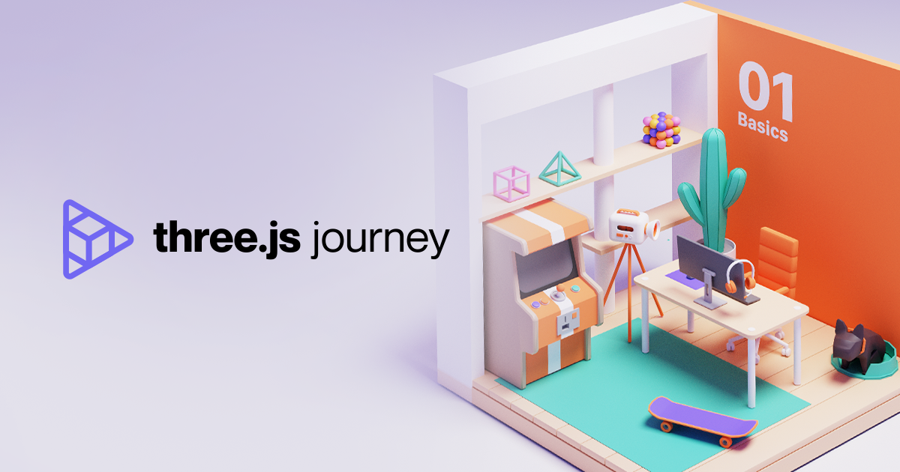

# Animation

:::info
Three.js-journey 강의노트 - 06 Animation
:::
## HTML 생성   
   
3D 오브젝트를 움직이기 위해서 화면위에 빨간 상자를 하나 띄워 본다.   
HTML로 캔버스를 만들고 threejs를 import 한 script 작성

```html
<!DOCTYPE html>
<html lang="en">
<head>
    <meta charset="UTF-8">
    <meta name="viewport" content="width=device-width, initial-scale=1.0">
    <title>Animations</title>
</head>
<body>
    <canvas class="webgl"></canvas>
</body>
</html>
```
## Scene 및 오브젝트 생성

`threejs` 를 import 하고 `canvas` 를 쿼리셀럭터로 선택.   
`Scene` 생성후 [`BoxGeometry`](https://threejs.org/docs/index.html?q=boxge#api/en/geometries/BoxGeometry) 를 이용해 Box 오브젝트를 생성   

```js
import * as THREE from 'three';

const canvas = document.querySelector('canvas.webgl');
const scene = new THREE.Scene();

const geometry = new THREE.BoxGeometry(1, 1, 1);
const material = new THREE.MeshBasicMaterial({ color: 0x00ff00 });
const mesh = new THREE.Mesh(geometry, material);
scene.add(mesh);
```   
## 캔버스 사이즈 설정, 카메라, 렌더링
`canvas`사이즈를 적당히 설정하고 [카메라](https://threejs.org/docs/index.html?q=camera#api/en/cameras/Camera) 셋팅 많은 카메라 셋팅을 이용해 scene를 구성 
`PerspectiveCamera` : 가장 일반적인 모드이고 원근법이 적용되는 3D화면을 볼때 이용되는 카메라. 인간의 눈이 보는 방식을 모방하도록 설계됨. 

```js
const sizes = {
  width: 800,
  height: 600,
};
// 카메라
const camera = new THREE.PerspectiveCamera(75, sizes.width / sizes.height);
camera.position.z = 3;
scene.add(camera);
// 렌더링
const renderer = new THREE.WebGLRenderer({
  canvas: canvas,
});
renderer.setSize(sizes.width, sizes.height);
```   
## Clock, tick()
`clock` threejs에서 시간을 추적 또는 관리할 수 있는 객체.    
`tick()` 함수를 이용해 오브젝트의 애니메이션을 실행
```js
// clock
const clock = new THREE.Clock()
const tick = () => {
  const elapsedTime = clock.getElapsedTime()

  camera.position.x = Math.sin(elapsedTime);
  camera.position.y = Math.cos(elapsedTime);
  camera.lookAt(mesh.position);
  renderer.render(scene, camera);
  window.requestAnimationFrame(tick);
};

tick();
```
