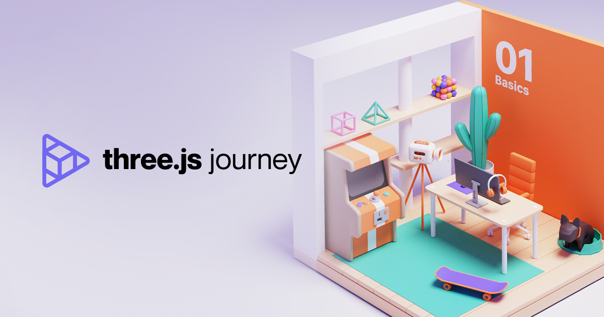

# Camera

:::tip INFO
Three.js-journey 강의노트 - 07 cameras
:::


## Mouse Cursor   
마우스를 이용해 커서로 카메라 움직임을 가져가기 위해서는 페이지에서 마우스의 위치를 조절
`javascript`의 `addEventListener`를 이용해 마우스위 위치를 확인
콘솔창을 열어서 로그로 위치를 확인 할 수 있다.
<video width="680" height="360" controls>
  <source src="../videos/addeventlistener-mousemove.mp4" type="video/mp4">
</video>   
같은 방법으로 `x`축과 `y` 축의 로그를 띄울 수 있다.

```js
// Cursor
window.addEventListener('mousemove', (event) => {
    console.log(event.clientX, event.clientY)
});
```   

## 카메라 무빙
`event.clientWidth`를 `sizes.width` 로 나누면 `0` 에서 `1` 사이의 값을 가질 수 있고 중심에서 움직이기 위해 0.5를 빼준다. 이제 마우스 커서로 카메라를 조정 할 수 있다.   
아래 결과물처럼 `X` 축에서는 마우스의 반대방향 (카메라의 방향) 으로 정상적으로 움직이지만 `Y`축은 물체와 마우스가 동일한 방향으로 움직이는 것을 볼 수 있다.
이때는 간단하게 `Y`축을 `-` 연산으로 반대방향 설정   
  <video width="680" height="360" controls>
    <source src="../videos/mousemove-01.mp4" type="video/mp4">
  </video>   
```js
window.addEventListener('mousemove', (event) => {
    cursor.x = event.clientX / sizes.width - 0.5
    cursor.y = - (event.clientY / sizes.height - 0.5)
})
```   
  <video width="680" height="360" controls>
    <source src="../videos/mousemove-02.mp4" type="video/mp4">
  </video>

`camera.position.x`와 `camera.position.z` 를 각각 내장함수인`sin` `cos`으로 커서의 위치로 오브젝트를 회전시킬 수 있다.   
이후 오브젝트를 위와 아래에서 볼 수 있도록 `camera.position.y` 도 `cursor.y`로 설정 

  <video width="680" height="360" controls>
    <source src="../videos/mousemove-03.mp4" type="video/mp4">
  </video>

```js
camera.position.x = Math.sin(cursor.x * 10) * 3
camera.position.z = Math.cos(cursor.x * 10) * 3
camera.position.y = cursor.y * 5
camera.lookAt(mesh.position)
```   
`tick()` 함수를 이용해 오브젝트의 애니메이션을 실행

```js
const tick = () =>
{
    // ...

    // Update camera
    camera.position.x = cursor.x
    camera.position.y = cursor.y

    // ...
} 
```   
## Controls   
`camera` 포지션으로 오브젝트를 볼 수 있지만 `controls` 더많은 기능을 구현 할 수 있다.
그중 [`OrbitControld`](https://threejs.org/docs/index.html?q=orbitcontrol#examples/en/controls/OrbitControls) 을 이용하여 비슷한 효과를 구현

```js

const controls = new OrbitControls(camera, canvas)
controls.enableDamping = true

```
 <video width="680" height="360" controls>
    <source src="../videos/mousemove-04.mp4" type="video/mp4">
  </video>

